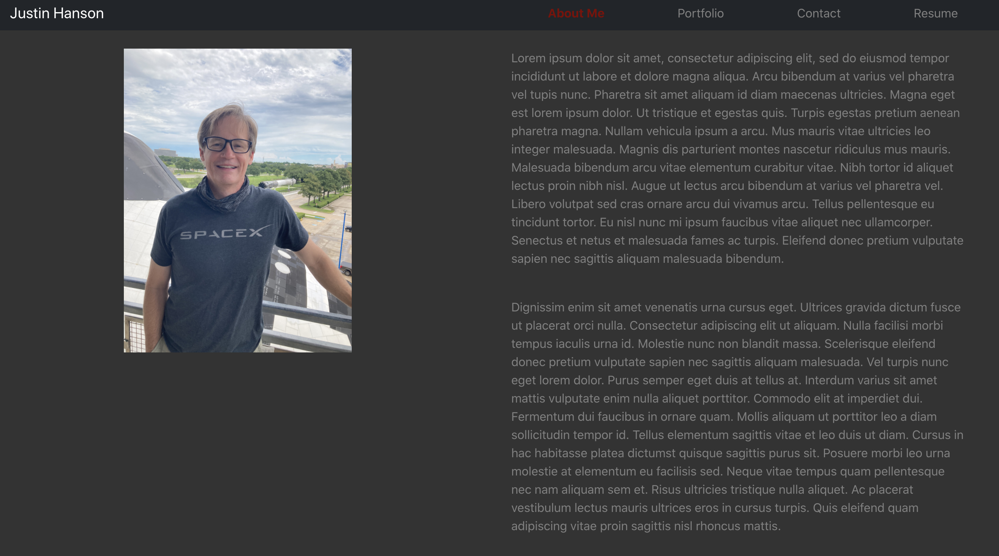
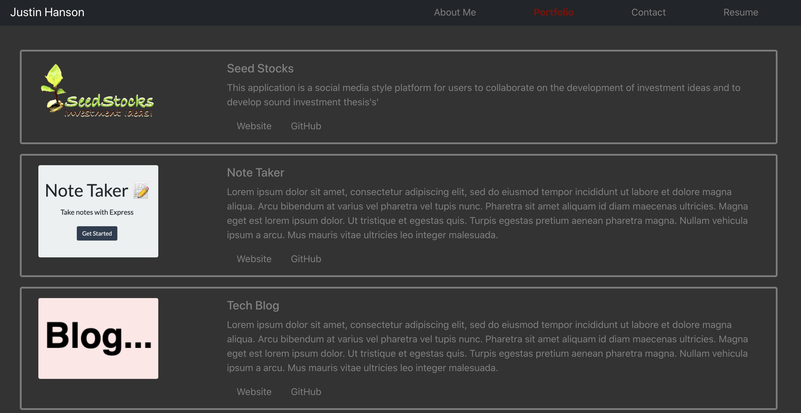
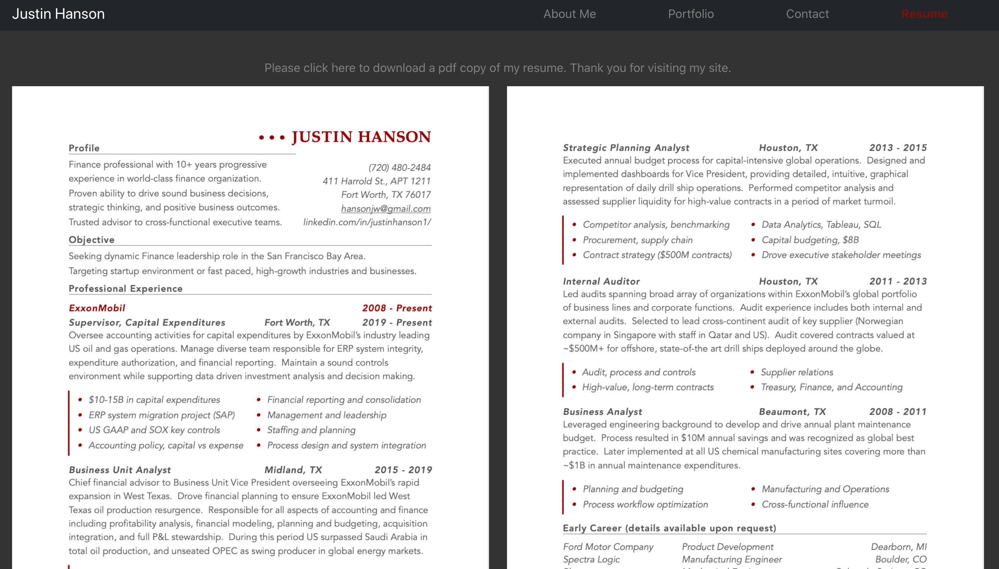
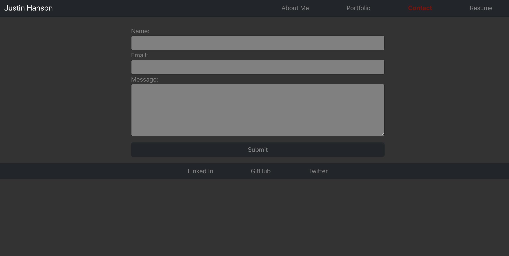

# My Portfolio  
No license is applicable for this application

## Description
This is a portfolio of applications that I have developed throughout the course of the UCB coding bootcamp, July 2020 cohort.

## Table of Contents
[Installation Instructions](#installation)  
[How to use This Application](#how-to)  
[How to Contibute](#contribute)  
[License Information](#license)  
[Questions](#questions)  
[Design/Requirements](#requirements)
[More Screenshots](#screenshots)

## Installation
Please access the website at the following link:

## How-To
This application is a simple website

## Contribute
This project was done as an assignment for the UCB coding bootcamp and is not open to contributions.

## License
This application is covered under the following license...
No License  
For more information on the license click on the badge below:
No license is applicable for this application

## Questions
For questions, comments, suggestions, I can be reached at the following  
https://github.com/hansonjw/  
hansonjw@gmail.com

## Design
NAV / Header:
- A single Header component that appears on multiple pages
- A single Navigation component within the header that will be used to conditionally render the different sections of your portfolio
- Sections:
    (1) About Me
    (2) Portfolio
    (3) Contact
    (4) Resume
- Current section is displayed in Header

About Me:
- Picture
- Paragraph bio paragraph
- Default when page initially loaads

Portfolio
- Six Images - Applications
- Link to deployed application
- Link to Github Repo

Contact:
- Form
- name
- email address
- message

Resume
- Link to downloadable file
- List of Devloper's proficiencies

Footer
- GitHub
- LinkedIn
- Third Platform (twitter?)

## Screenshots

